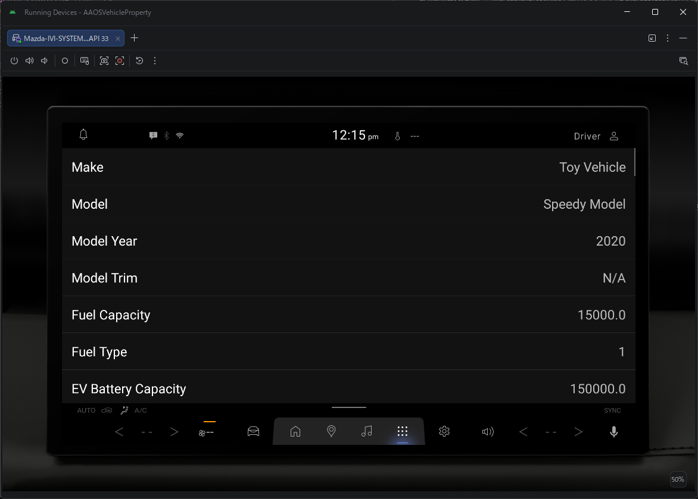
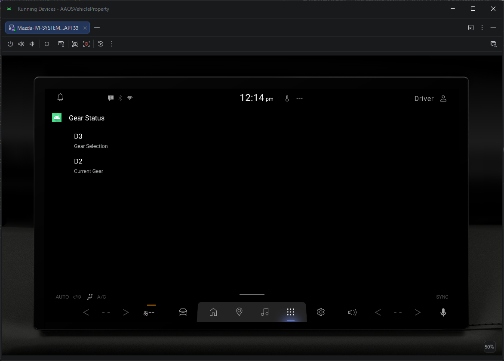

**注意: このプロジェクトのコードおよびドキュメントは、AI（LLM）によって生成されています。**

# AAOS Vehicle Property Project

本プロジェクトは、Android Automotive OS (AAOS) において一般アプリ（サードパーティ製アプリ）からアクセス可能な車両プロパティを表示・確認するためのサンプルアプリケーションです。

## アプリ概要

本プロジェクトには、用途の異なる2つのランチャーアクティビティが含まれています。

### 1. Vehicle Property List (Mobile Activity)
車両の主要なプロパティ（静的情報、動的ステータス、表示単位など）をリスト形式で一覧表示するアプリです。VHAL (Vehicle Hardware Abstraction Layer) がどの情報を公開しているかを網羅的に確認するのに適しています。



### 2. Gear Status (Car App Library)
Car App Library を使用して作成された、運転中でも視認性の高いダッシュボードアプリです。現在のギア選択状態（P/R/N/D）と、実際の変速段数（1st, 2nd...）を大きく表示します。



---

# Android Automotive OS：一般アプリからREAD可能なVehiclePropertyIds一覧

> **対象**: system / privileged appではない通常のAAOSアプリ（一般APK）  
> **注意**: Android API上で一般アプリ向けREAD権限が用意されていても、実車で取得できるかどうかはOEMのVHAL実装、車種、グレード、搭載センサーに依存します。

## 1. 車両基本情報

| VehiclePropertyIds | 内容 | Permission |
|---|---|---|
| `INFO_MAKE` | メーカー / ブランド | `CAR_INFO` |
| `INFO_MODEL` | 車種名 | `CAR_INFO` |
| `INFO_MODEL_YEAR` | モデル年 | `CAR_INFO` |
| `INFO_MODEL_TRIM` | グレード | `CAR_INFO` |
| `INFO_FUEL_CAPACITY` | 燃料タンク容量 | `CAR_INFO` |
| `INFO_FUEL_TYPE` | 燃料種別 | `CAR_INFO` |
| `INFO_EV_BATTERY_CAPACITY` | EV公称バッテリー容量 | `CAR_INFO` |
| `INFO_EV_CONNECTOR_TYPE` | EV充電コネクタ種別 | `CAR_INFO` |
| `INFO_FUEL_DOOR_LOCATION` | 給油口位置 | `CAR_INFO` |
| `INFO_EV_PORT_LOCATION` | EV充電口位置 | `CAR_INFO` |
| `INFO_MULTI_EV_PORT_LOCATIONS` | 複数EV充電口位置 | `CAR_INFO` |
| `INFO_DRIVER_SEAT` | 運転席位置 | `CAR_INFO` |
| `INFO_EXTERIOR_DIMENSIONS` | 車両外形寸法 | `CAR_INFO` |
| `INFO_VEHICLE_SIZE_CLASS` | 車両サイズクラス | `CAR_INFO` |
| `VEHICLE_CURB_WEIGHT` | 車両重量 | `CAR_INFO` |
| `GENERAL_SAFETY_REGULATION_COMPLIANCE` | EU GSR対応情報 | `CAR_INFO` |
| `ELECTRONIC_TOLL_COLLECTION_CARD_TYPE` | ETCカード種別 | `CAR_INFO` |
| `ELECTRONIC_TOLL_COLLECTION_CARD_STATUS` | ETCカード状態 | `CAR_INFO` |

### 一般アプリから取得不可の代表例

- `INFO_VIN` — `CAR_IDENTIFICATION`（Signature / Privileged）が必要。

## 2. 走行状態・パワートレイン

| Property | 内容 | Permission |
|---|---|---|
| `PERF_VEHICLE_SPEED` | 実車速 | `CAR_SPEED` ※ |
| `PERF_VEHICLE_SPEED_DISPLAY` | メーター表示車速 | `CAR_SPEED` ※ |
| `WHEEL_TICK` | 各輪の走行tick | `CAR_SPEED` ※ |
| `GEAR_SELECTION` | 選択ギア | `CAR_POWERTRAIN` |
| `CURRENT_GEAR` | 現在ギア | `CAR_POWERTRAIN` |
| `PARKING_BRAKE_ON` | パーキングブレーキ | `CAR_POWERTRAIN` |
| `PARKING_BRAKE_AUTO_APPLY` | 自動パーキングブレーキ | `CAR_POWERTRAIN` |
| `IGNITION_STATE` | イグニッション状態 | `CAR_POWERTRAIN` |
| `EV_BRAKE_REGENERATION_LEVEL` | 回生ブレーキレベル | `CAR_POWERTRAIN` |
| `EV_STOPPING_MODE` | EV停止モード | `CAR_POWERTRAIN` |
| `ENGINE_RPM` | エンジン回転数 | `CAR_ENGINE_DETAILED_3P` ※ |

※ = Dangerous permission（実行時にユーザーの許可が必要な権限）

## 3. アクセル・ブレーキ

| Property | 内容 | Permission |
|---|---|---|
| `ACCELERATOR_PEDAL_COMPRESSION_PERCENTAGE` | アクセルペダル踏込み率 | `READ_CAR_PEDALS` ※ |
| `BRAKE_PEDAL_COMPRESSION_PERCENTAGE` | ブレーキペダル踏込み率 | `READ_CAR_PEDALS` ※ |
| `BRAKE_FLUID_LEVEL_LOW` | ブレーキフルード低下 | `READ_BRAKE_INFO` ※ |
| `BRAKE_PAD_WEAR_PERCENTAGE` | ブレーキパッド摩耗率 | `READ_BRAKE_INFO` ※ |

VHAL側が実装していれば、車速・RPM・アクセル・ブレーキを組み合わせた簡易ドライビングロガーを構成できます。

## 4. ステアリング

| Property | 内容 | Permission |
|---|---|---|
| `PERF_STEERING_ANGLE` | 前輪操舵角 | `READ_CAR_STEERING_3P` ※ |

`PERF_STEERING_ANGLE` はステアリングホイールの回転角そのものではなく、車両モデル上の前輪操舵角です。

### 一般アプリから取得不可の代表例

- `PERF_REAR_STEERING_ANGLE` — `READ_STEERING_STATE`（Signature / Privileged）が必要。

## 5. タイヤ

| Property | 内容 | Permission |
|---|---|---|
| `TIRE_PRESSURE` | タイヤ空気圧 | `CAR_TIRES_3P` ※ |
| `TIRE_PRESSURE_DISPLAY_UNITS` | 空気圧表示単位 | `READ_CAR_DISPLAY_UNITS` |

`TIRE_PRESSURE` はWheel Areaごとに左前・右前・左後・右後などを個別取得できます。

## 6. 燃料・EV・航続距離

| Property | 内容 | Permission |
|---|---|---|
| `FUEL_LEVEL` | 燃料残量 | `CAR_ENERGY` ※ |
| `FUEL_LEVEL_LOW` | 燃料残量警告 | `CAR_ENERGY` ※ |
| `RANGE_REMAINING` | 航続可能距離 | `CAR_ENERGY` ※ |
| `EV_BATTERY_LEVEL` | EVバッテリー残量 | `CAR_ENERGY` ※ |
| `EV_CURRENT_BATTERY_CAPACITY` | 現在の実使用可能容量 | `CAR_ENERGY` ※ |
| `EV_BATTERY_AVERAGE_TEMPERATURE` | EVバッテリー平均温度 | `CAR_ENERGY` ※ |
| `EV_BATTERY_INSTANTANEOUS_CHARGE_RATE` | 瞬間充放電電力 | `CAR_ENERGY` ※ |
| `EV_CHARGE_STATE` | 充電状態 | `CAR_ENERGY` ※ |
| `EV_CHARGE_TIME_REMAINING` | 推定充電残り時間（秒） | `CAR_ENERGY` ※ |
| `EV_REGENERATIVE_BRAKING_STATE` | 回生状態 | `CAR_ENERGY` ※ |
| `EV_CHARGE_CURRENT_DRAW_LIMIT` | AC充電電流上限 | `CAR_ENERGY` ※ |
| `EV_CHARGE_PERCENT_LIMIT` | 充電上限SOC | `CAR_ENERGY` ※ |
| `EV_CHARGE_PORT_CONNECTED` | 充電ケーブル接続 | `CAR_ENERGY_PORTS` |
| `EV_CHARGE_PORT_OPEN` | 充電口状態 | `CAR_ENERGY_PORTS` |
| `FUEL_DOOR_OPEN` | 給油口状態 | `CAR_ENERGY_PORTS` |

## 7. 燃費・電費・走行距離

| Property | 内容 | Permission |
|---|---|---|
| `INSTANTANEOUS_FUEL_ECONOMY` | 瞬間燃費 | `CAR_MILEAGE_3P` ※ |
| `INSTANTANEOUS_EV_EFFICIENCY` | 瞬間電費 | `CAR_MILEAGE_3P` ※ |
| `PERF_ODOMETER` | オドメーター (総走行距離) | `CAR_MILEAGE_3P` ※ |

## 8. 外部環境

| Property | 内容 | Permission |
|---|---|---|
| `ENV_OUTSIDE_TEMPERATURE` | 外気温 | `CAR_EXTERIOR_ENVIRONMENT` |
| `NIGHT_MODE` | 周囲が暗い / 明るい | `CAR_EXTERIOR_ENVIRONMENT` |

## 9. 表示単位

| Property | 内容 | Permission |
|---|---|---|
| `DISTANCE_DISPLAY_UNITS` | 距離 | `READ_CAR_DISPLAY_UNITS` |
| `FUEL_VOLUME_DISPLAY_UNITS` | 燃料量 | `READ_CAR_DISPLAY_UNITS` |
| `TIRE_PRESSURE_DISPLAY_UNITS` | 空気圧 | `READ_CAR_DISPLAY_UNITS` |
| `VEHICLE_SPEED_DISPLAY_UNITS` | 車速 | `READ_CAR_DISPLAY_UNITS` |
| `EV_BATTERY_DISPLAY_UNITS` | EV容量 | `READ_CAR_DISPLAY_UNITS` |
| `HVAC_TEMPERATURE_DISPLAY_UNITS` | HVAC温度 | `READ_CAR_DISPLAY_UNITS` |
| `FUEL_CONSUMPTION_UNITS_DISTANCE_OVER_VOLUME` | 燃費表示方式 | `READ_CAR_DISPLAY_UNITS` |

## 10. ライト・ウインカー

| Property | 内容 | Permission |
|---|---|---|
| `TURN_SIGNAL_LIGHT_STATE` | 実際のウインカー点灯状態 | `READ_CAR_EXTERIOR_LIGHTS` ※ |
| `TURN_SIGNAL_SWITCH` | ウインカーレバー / スイッチ状態 | `READ_CAR_EXTERIOR_LIGHTS` ※ |

## 11. ワイパー

| Property | 内容 | Permission |
|---|---|---|
| `WINDSHIELD_WIPERS_STATE` | ワイパー実動作状態 | `READ_WINDSHIELD_WIPERS_3P` ※ |

## 12. ホーン

| Property | 内容 | Permission |
|---|---|---|
| `VEHICLE_HORN_ENGAGED` | ホーンが鳴っているか | `READ_CAR_HORN` ※ |

## 13. 座席状態

| Property | 内容 | Permission |
|---|---|---|
| `SEAT_OCCUPANCY` | 座席の乗員有無 | `READ_CAR_SEATS` ※ |

## 14. 自動運転状態

| Property | 内容 | Permission |
|---|---|---|
| `VEHICLE_DRIVING_AUTOMATION_CURRENT_LEVEL` | 現在の自動運転レベル | `CAR_DRIVING_STATE_3P` ※ |

## 車両ロガー用途で特に有用なProperty

```text
PERF_VEHICLE_SPEED
ENGINE_RPM
ACCELERATOR_PEDAL_COMPRESSION_PERCENTAGE
BRAKE_PEDAL_COMPRESSION_PERCENTAGE
PERF_STEERING_ANGLE
GEAR_SELECTION
CURRENT_GEAR
TIRE_PRESSURE
FUEL_LEVEL
EV_BATTERY_LEVEL
INSTANTANEOUS_FUEL_ECONOMY
INSTANTANEOUS_EV_EFFICIENCY
ENV_OUTSIDE_TEMPERATURE
TURN_SIGNAL_LIGHT_STATE
WINDSHIELD_WIPERS_STATE
```

VHALが対応していれば、OBD-IIを介さずAAOSアプリから直接これらの車両情報を取得できます。

## 実車で取得できる条件

実際に取得可能なPropertyは、次の積集合になります。

```text
Androidが一般APK向けREADを許可しているProperty
                    AND
        OEMがVHALに実装しているProperty
                    AND
       その車種・グレードに存在する情報
```

## 参考資料

- Android Developers: `android.car.VehiclePropertyIds`
  - https://developer.android.com/reference/android/car/VehiclePropertyIds
- Android Developers: Car Hardware APIs
  - https://developer.android.com/training/cars/apps/library/car-hardware-api
